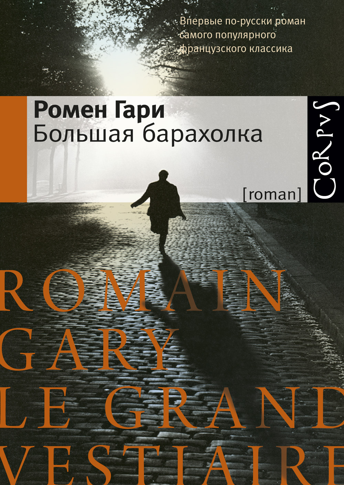
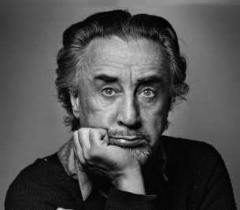

#  Большая барахолка Ромен Гари

Запомните, юноша, главное в жизни — не оказаться в нужном месте в нужное время, вот и вся премудрость. Надо, подобрав живот и не отбрасывая тени, ловко пробираться сквозь чащу лет, чтоб ни за что не зацепиться. Так оно все устроено. А проделать это можно только в одиночку. И никак иначе! 

Жизнь — как убийство, тут сообщников иметь опасно. Важно, чтоб тебя не поймали с поличным как живущего на этом свете. Можете не верить, юноша, дело ваше, но тысячам людей это удается. Они остаются невидимками, в полнейшем смысле слова невидимками! К ним просто-напросто не пристает судьба — не прилипает. Они ее минуют. Слыхали выражение «человеческий удел»? Так вот, он им не достается. 

Судьба с них — как с гуся вода. Окатывает их тепленьким душем, но они непромокаемы. Такие люди умирают в глубокой старости, совсем одряхлев, во сне, и это их победа! Они всех одурачили! Их никто не заметил! Это чудо! Жить невидимкой — великое искусство, запомните, юноша, запомните сегодня, сейчас. Все время пригибаться, проверять, нет ли дождя, прежде чем высунуть нос на улицу. 

Все время озираться, прислушиваться, не идут ли за тобою следом, стараться стать ма-ахоньким-махоньким, вот такусеньким! Быть и по правде пылью! Знаете, юноша, я убежден, что если быть предельно осторожным, то даже смерть вас не заметит. Обойдет стороной. Упустит. 

Трудно заметить человечка, который хорошо спрятался. Можно дожить себе припеваючи до преклонных лет, но, разумеется, тайком. Жизнь, юноша, запомните крепко-накрепко, — это исключительно вопрос маскировки. Если не нарушать маскировку, все пойдет наилучшим образом. Смотрите, ведь любой почтенный старец счастливо избежал своей молодости. Молодость — опасная штука. Страшно опасная. Избежать ее трудно, но можно.

## Некоторые, юноша, так безумно влюбляются в жизнь, что готовы умереть, лишь бы с ней не расставаться.

 

Гомен Гари